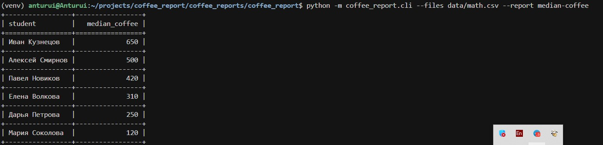

# Отчет о потреблении кофе

CLI-утилита для анализа данных о подготовке студентов к экзаменам. 
Формирует отчеты (медиана, среднее и др.) по данным из CSV-файлов.

## Архитектура

Проект построен с учетом расширяемости:
- **Модуль readers** — чтение CSV (только стандартная библиотека)
- **Модуль reports** — система плагинов через декоратор `@register_report`
- **Модуль formatters** — вывод в консоль (tabulate)

Добавление нового отчета: создать класс, унаследовать от `BaseReport`, 
добавить декоратор `@register_report('название')` — готово.

## Установка

```bash
git clone https://github.com/Anturui/coffee-report.git
cd coffee-report
python -m venv venv
source venv/bin/activate
pip install -e .
```

## Пример работы

Запуск с одним файлом:
```bash
python -m coffee_report.cli --files data/math.csv --report median-coffee
```

**Результат:**



*Таблица отсортирована по убыванию медианных трат на кофе*

## Использование

```bash
# Медиана по кофе (основной отчет)
python -m coffee_report.cli --files data/math.csv data/physics.csv --report median-coffee

# Список доступных отчетов
python -m coffee_report.cli --help
```

## Тестирование

```bash
pytest -v
pytest --cov=coffee_report --cov-report=term-missing
```

## Структура проекта

```
coffee_report/
├── coffee_report/
│   ├── cli.py              # Точка входа (argparse)
│   ├── readers.py          # Чтение CSV
│   ├── formatters.py       # Форматирование таблиц
│   └── reports/
│       ├── base.py         # Базовый класс
│       ├── registry.py     # Реестр отчетов
│       └── median_coffee.py # Реализация отчета
├── tests/                  # Pytest
└── data/                   # Примеры CSV
```

## Требования

- Python 3.8+
- В основном коде только стандартная библиотека (argparse, csv, statistics, abc)
- Для вывода в консоль: tabulate
- Для тестов: pytest, pytest-cov
```
